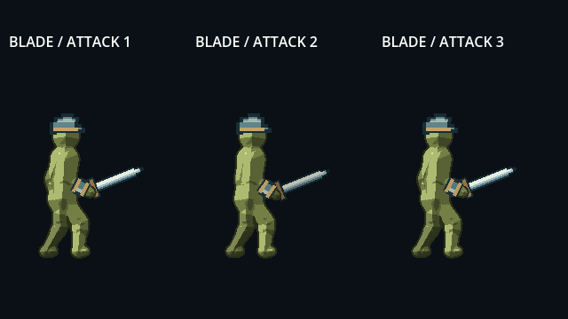
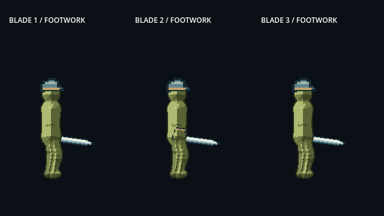
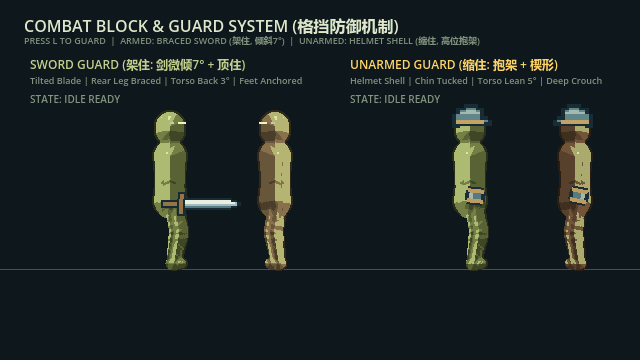

# Contra-Avalokita: The Dead Decibel

<div align="center">

# 反观世音：绝响

**Sci-Fi Buddhist Action RPG / Roguelite · Godot 4.7**

一款围绕 **轮回、意识、机械宗教与可塑肉身** 构建的 2D 横版动作游戏。

<br>



<br>

*Procedural Mud Body · Layered Animation · SDF Rendering · Roguelite Morphing*

</div>

---

## Overview

《反观世音：绝响》是一款正在开发中的 **科幻禅派 2D 动作 RPG / Roguelite**。

游戏中的人物并非传统逐帧 Sprite 角色。

角色由 Skeleton2D 驱动骨骼姿态，再根据骨骼控制点实时生成 SDF 肉身：

```text
Skeleton2D
    ↓
Bone Pose / IK / FK
    ↓
SDF Capsules
    ↓
Smooth Union
    ↓
Pixel Shader
    ↓
Mud Body
```

因此角色身体能够在动画过程中自然发生：

* 关节压缩
* 软体滞后
* 受击凹陷
* 身体膨胀
* 缺损与异化
* 死亡坍塌
* 像素飞升

后续 Roguelite 系统将在此基础上允许 Build 直接改变角色的肉身形态。

---

## Development Status

> **Current Stage: Core Gameplay Prototype**

目前开发重点是建立可以长期扩展的：

**Character → Combat → Renderer → Roguelite → Content Pipeline**

而非大量生产关卡内容。

### Implemented

* [x] Idle / Walk / Run
* [x] Jump / Fall / Landing
* [x] Wall Hang / Wall Slide / Wall Jump
* [x] Skeleton2D 角色 Rig
* [x] FK / IK 姿态系统
* [x] 上下半身动画分层
* [x] 刀剑三段攻击
* [x] Weapon Hitbox / Character Hurtbox
* [x] 格挡
* [x] 前后肢体动态深度
* [x] 装备挂点
* [x] SDF 程序化泥身
* [x] SDF 受击反馈
* [x] 死亡坍塌与像素飞升
* [x] 六道数字伤害显示
* [x] 击杀评分
* [x] 多角色压力测试

### In Progress / Planned

* [ ] SDF Morph System
* [ ] Armor Renderer
* [ ] Roguelite Run Manager
* [ ] Karma / 六道系统
* [ ] Content Registry
* [ ] 正式 Boot Flow
* [ ] Main Menu / HUD
* [ ] Save System
* [ ] Developer Console
* [ ] DLC Content Interface
* [ ] Mod SDK
* [ ] 正式敌人与 Boss
* [ ] 第一套正式关卡

---

# Character System

## Procedural Animation

角色动作并非简单播放完整动画。

当前系统将：

```text
Locomotion
+
Upper Body Action
+
IK Correction
+
Procedural Footwork
+
Soft-body Follow
```

组合为最终姿势。

<div align="center">



**移动姿态与攻击动作分层**

</div>

刀剑攻击不会完全覆盖当前移动状态。

例如角色正在奔跑时发动攻击：

```text
Run Legs
    +
Blade Upper Body
    +
Attack Footwork Offset
    ↓
Final Pose
```

因此角色能够在：

* Walk
* Run
* Jump
* Fall

期间执行攻击，而不会突然切换到完全静止的攻击动画。

---

## Movement

当前移动系统包括：

```text
Idle
Walk
Run

JumpSquat
Takeoff
Rise
Apex
Fall
Landing

WallHang
WallSlide
WallPush
WallRelease
```

步态包含：

* 支撑腿与摆动腿切换
* 骨盆承重
* 脚跟着地
* 脚尖离地
* 肩胯反向运动
* 手臂惯性
* 起步与制动质量滞后

角色骨架同时作为 SDF Renderer 的实时形体输入。

---

# Combat

当前第一套完整验证武器为刀剑。

<div align="center">


**Blade Combo Prototype**

</div>

基础连段：

```text
Attack 1
   ↓
Attack 2
   ↓
Attack 3
```

每次攻击内部进一步划分：

```text
Anticipation
      ↓
Active
      ↓
Follow-through
      ↓
Recovery
```

攻击输入允许缓存下一段 Combo。

Hitbox 与视觉剑光相互独立：

```text
Weapon Hitbox
=
实际伤害

Trail / Slash VFX
=
视觉反馈
```

---

## Blocking

<div align="center">



**Block Prototype**

</div>

格挡目前拥有独立姿势和伤害反馈接口。

未来将继续扩展：

```text
Block
Perfect Block
Parry
Guard Break
Counter
```

---

# SDF Character Renderer

角色肉身由实时 Signed Distance Field 构成。

基础流程：

```text
Bone Anchors
      ↓
Capsule Segments
      ↓
Smooth Union
      ↓
Depth Classification
      ↓
Pixel Shading
```

基础人体目前由约 24 个可复用胶囊段组成。

Renderer 最大容量当前为：

```text
MAX_SEGMENTS = 40
```

---

## Body Deformation

Renderer 可以根据动作与状态修改身体形体：

```text
Joint Compression
Foot Squash

Impact Dent
Impact Bulge
Impact Ripple

Death Collapse
Death Dissolve
```

这意味着受击不是简单播放一个 Sprite Flash。

冲击能够实际改变角色 SDF 的局部轮廓。

---

## Render Layers

角色使用多个 SDF Pass 处理前后肢体关系：

```text
Rear Mud        -6
Rear Equipment  -5
Rear Weapon     -4

Body             0

Front Mud        4
Front Equipment  5
Front Weapon     6

Head Equipment  10
```

因此：

```text
远侧手
    ↓
身体
    ↓
近侧手
```

能够产生稳定的 2D 空间遮挡。

武器、护腕等装备也可以正确穿插在角色身体前后。

---

# Visual Architecture

角色视觉系统遵循四层职责：

| Layer         | Responsibility |
| ------------- | -------------- |
| **SDF Body**  | 肉身、软体形变、生物异化   |
| **Equipment** | 装甲、面具、护腕、硬质结构  |
| **Weapon**    | 武器与独立 Hitbox   |
| **VFX**       | 技能、粒子、光效、异象    |

原则：

```text
SDF
=
肉

Sprite
=
甲

Shader
=
材质

VFX
=
异象
```

普通硬质装甲不会被并入身体 SDF。

---

# Roguelite Direction

未来肉鸽系统不会只修改角色数值。

Build 可以进一步修改角色自身的视觉形态。

例如：

```text
Hungry Ghost
→ 腹部 SDF 缺损

Asura
→ 肩部与手臂增生

Deva
→ 头部 / 背部光学结构

Hell
→ 身体裂口与高温材质
```

计划中的 SDF Morph 系统：

```text
Base Body
    ↓
ADD Morph
    ↓
SUBTRACT Morph
    ↓
Material State
    ↓
Final Body
```

使一局游戏的 Build 最终能够直接表现为角色轮廓变化。

---

# Controls

当前测试场景：

| Action            | Input                |
| ----------------- | -------------------- |
| Move              | `A / D` / Arrow Keys |
| Run               | `Shift + Move`       |
| Jump              | `Space`              |
| Wall Hang / Slide | 空中持续朝墙移动             |
| Wall Jump         | 墙面状态下 `Space`        |
| Attack            | `J` / Mouse Left     |
| Toggle Equipment  | `E`                  |
| Equip Sword       | `1`                  |
| Unequip Weapon    | `2`                  |
| Debug View        | `F1`                 |
| Crowd Test        | `T`                  |
| Reset             | `R`                  |

这些输入属于开发测试配置，并非最终玩家键位。

---

# Quick Start

## Requirements

推荐：

```text
Godot 4.7.x
```

Clone repository：

```bash
git clone https://github.com/himentpear/Contra-Avalokita.git
```

打开：

```text
contra-avalokita/project.godot
```

当前主要测试场景：

```text
scenes/test_arena.tscn
```

可以直接运行 Main Scene 或单独运行测试场景。

---

# Tech Stack

### Engine

* Godot 4.7
* GDScript
* 2D Canvas Renderer
* Compatibility Rendering
* Runtime ShaderMaterial

### Character

* CharacterBody2D
* Skeleton2D
* Bone2D
* FK
* Analytic IK
* AnimationPlayer
* Procedural Locomotion

### Rendering

* Signed Distance Field
* Smooth Union Capsules
* Multi-pass Depth Rendering
* Pixel Quantized Lighting
* Dynamic SDF Deformation

### Reference Resolution

```text
640 × 360
```

使用 integer scaling 与 pixel snapping。

---

# Current Project Structure

当前原型工程主要组织为：

```text
contra-avalokita/
│
├── assets/
│   ├── backgrounds/
│   ├── fonts/
│   └── equipment/
│
├── scenes/
│   ├── equipment/
│   ├── weapons/
│   ├── mud_character.tscn
│   └── test_arena.tscn
│
├── scripts/
│
├── shaders/
│
├── resources/
│
├── docs/
│
├── artifacts/
│
├── project.godot
└── README.md
```

`artifacts/` 当前主要保存开发阶段的动画预览、测试截图和参考结果。

其中被 README 使用的 GIF 应视为长期项目展示资产。

后续建议迁移至：

```text
docs/media/
```

例如：

```text
docs/media/blade_attacks.gif
docs/media/blade_footwork_layers.gif
docs/media/block_preview.gif
```

其余临时截图、关键帧序列和测试导出物无需长期进入仓库。

---

# Target Architecture

项目后续计划逐步迁移为：

```text
bootstrap/
│
├── boot.tscn
└── package_loader.gd

core/
├── app/
├── content/
├── events/
├── save/
└── debug/

gameplay/
├── character/
├── combat/
├── roguelike/
├── world/
└── ai/

content/
├── base/
└── shared/

ui/
├── main_menu/
├── hud/
├── inventory/
├── content_browser/
└── console/

extensions/
├── dlc/
└── mod_sdk/

tests/
tools/
docs/
```

核心原则：

> **Gameplay 定义规则，Content 定义游戏里有什么。**

---

# Content Architecture

未来所有正式游戏内容将使用稳定 Content ID，而不是将资源路径作为身份。

例如：

```text
base:sword
base:mudborn
base:hungry_ghost

dlc01:vajra_blade

example_mod:red_sword
```

运行时：

```text
Gameplay
    ↓
ContentRegistry
    ↓
┌─────────┬────────┬────────┐
│         │        │        │
Base     DLC      MOD     Patch
```

Core Gameplay 不直接依赖具体 DLC 或 MOD。

---

# DLC

官方扩展内容计划作为独立 Content Pack 挂载。

```text
Core Game
+
Base Content
+
Official DLC
```

DLC 可注册：

* Character
* Weapon
* Item
* Morph
* Enemy
* Boss
* Encounter
* Level
* Dialogue
* UI Content

核心代码中不应存在：

```text
if DLC_01_INSTALLED:
```

而应通过 Content Registry 动态发现内容。

---

# Modding

计划支持两类 MOD。

## Data Mods

允许：

```text
JSON
Texture
Audio
Item Data
Enemy Data
Dialogue
Level Data
Morph Profile
```

不执行自定义 GDScript。

---

## Scripted Mods

高级 MOD 可以通过独立 PCK 提供：

```text
Scene
Resource
Shader
GDScript
```

Scripted MOD 将明确标记其包含可执行代码。

MOD 内容使用独立命名空间：

```text
mod_id:item_id
```

避免污染官方内容 ID。

---

# Developer Console

计划加入游戏内开发控制台：

```text
`
```

或：

```text
F10
```

示例：

```text
> spawn base:enemy_asura

> give base:sword

> sdf.morph base:hungry_ghost

> run.seed 114514

> content.list

> perf.sdf
```

命令由统一 `CommandRegistry` 管理。

未来自动化测试也可以复用同一 Command API。

---

# Documentation

README 只维护：

* 项目介绍
* 当前状态
* 游戏 GIF
* 快速运行
* 核心架构
* 开发入口

详细技术记录放置在：

```text
docs/
├── architecture/
├── animation/
├── combat/
├── renderer/
├── roguelike/
└── modding/
```

例如：

```text
docs/animation/locomotion.md
docs/animation/blade-combat.md

docs/renderer/sdf-character.md
docs/renderer/depth-layering.md

docs/architecture/content-system.md
```

避免把大量动画参数和实现实验长期堆积在仓库首页。

---

# Roadmap

```text
Character Core
      ↓
Combat Core
      ↓
Renderer / Morph
      ↓
Roguelite Runtime
      ↓
Content Pipeline
      ↓
World / Levels
      ↓
Complete Game Loop
```

当前优先：

```text
SDF Morph
Armor Renderer
Roguelite Runtime
Content Registry
Boot Flow
UI
Enemy Framework
Level Pipeline
Save System
```

---

# Repository Status

> **Active Development**

项目仍处于早期核心系统开发阶段。

以下内容可能随开发发生较大变化：

* API
* Scene Tree
* Resource Schema
* Animation Data
* Content Format
* Gameplay Rules
* Save Format

当前仓库目标首先是验证游戏的核心技术与玩法结构，而不是提供稳定公共 API。

---

# License

项目最终许可证尚未确定。

在正式许可证发布之前，请勿默认仓库中的：

* 源代码
* 美术
* 动画
* 音频
* 世界观内容

可以自由再分发或商业使用。

---

<div align="center">

### Contra-Avalokita: The Dead Decibel

**肉身可塑，业不可逃。**

</div>
