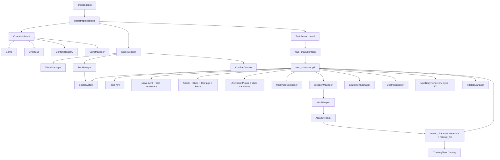
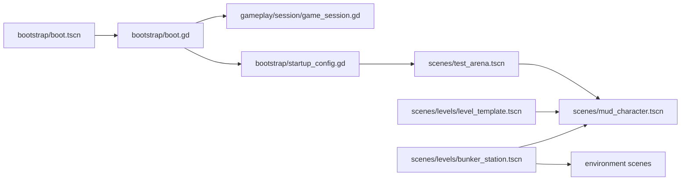
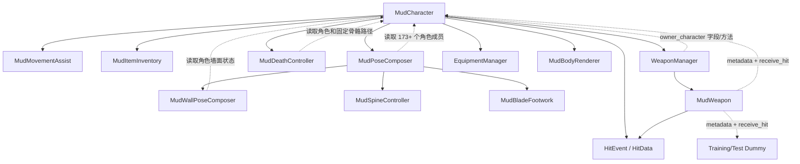

# Contra-Avalokita 架构审计（ECS 视角）

审计日期：2026-09-14  
审计范围：`gameplay/`、`core/`、`assets/`、`scenes/`、`scripts/`、`addons/`，并补充检查启动链、内容包和测试对这些目录的引用。  
审计方式：静态扫描 `.gd` / `.tscn` / `.tres` 的继承、预加载、场景实例、节点路径、Autoload、跨对象字段访问，并阅读角色、战斗、动画、装备、Roguelike 和 Session 的主执行路径。本报告不宣称运行时 profiler 结论。

## 1. 结论摘要

当前项目不是 ECS，而是“Godot Scene 组合 + 主角色脚本编排 + 若干半拆分控制器”的混合架构。项目已经建立了较好的应用层基础：Boot、Core、Content、Save、Session、World、Run 和 `CombatContext` 已经分层，部分旧路径也通过兼容 stub 迁到了 `gameplay/`。这部分不应推倒重来。

主要问题集中在角色运行时：

- `scripts/mud_character.gd` 有约 1430 行，同时拥有输入、移动、墙面动作、攻击、格挡、生命、韧性、伤害、死亡、动画状态、命中盒、装备调用、武器调用、渲染同步、定帧和计分桥接。
- `scenes/mud_character.tscn` 有约 7384 行、37 个节点、29 个内嵌 Animation、584 条动画轨道；骨架、角色配置、动画库和多个行为脚本被打包在一个场景中。
- `MudPoseComposer` 虽然从角色脚本抽出，但仍读取大量 `MudCharacter` 私有字段（静态扫描约 173 次 `character.*` 访问），属于单角色专用行为对象，不是通用 System。
- 武器脚本同时保存武器数值、驱动轨迹渲染、控制 Hitbox、构造伤害事件、修改攻击者表现、调用受击者、触发相机表现。
- Player 和 Enemy 复用了 `set_intent()` 入口，这是现有架构中值得保留的缝隙；但 Player 输入仍直接写在角色 `_physics_process()`，AI 控制器又被类型绑定到 `MudCharacter`。
- `training_dummy.gd`、`test_dummy_target.gd` 与 `mud_character.gd` 分别实现受击、韧性、反应和 Hitstop，已经出现 Enemy/目标重复逻辑。
- 六道目前主要是计分偏好和字形表现；真正的 Karma → 属性 Modifier 管线尚未实现。好处是可以从干净的数据模型开始，而不必先拆除一个成熟旧系统。

建议采用“渐进式 Godot ECS”，不是一次性换成纯数据导向框架：Entity 只注册身份与 Component；Component 使用可序列化的纯数据 `Resource`；System 由 Session/World 持有并批量处理符合组件签名的 Entity；物理、动画、Skeleton、Area2D 继续留在 Scene 作为 View/Engine Binding。迁移必须遵守单写者原则，每个字段只在一个 PR 中切换所有权。

## 2. 扫描概况

| 目录 | 当前内容 | ECS 评价 |
|---|---:|---|
| `core/` | 14 个 GDScript | 应用生命周期、内容、存档、设置、事件，职责总体合理；不应塞入角色 ECS 规则 |
| `gameplay/` | 13 个 GDScript | 已有 Session/World/Run/Combat 壳层，但 `CombatContext` 目前只是 actor 列表，不执行系统 |
| `scripts/` | 45 个 GDScript | 大部分角色、战斗、渲染和测试场逻辑仍在兼容目录；领域边界混杂 |
| `scenes/` | 15 个 `.tscn` | Level 结构较清楚；角色 Scene 过度承载动画资源与行为 |
| `assets/` | 149 个文件（含 53 个 import） | 字体、背景、角色源素材和根级装备贴图混放；大批第三方角色素材路径很深 |
| `addons/` | 4 个 GDScript | RotoBone 编辑器插件，与 runtime ECS 应保持隔离 |
| `tests/`（补充） | 57 个 GDScript、5 个 `.tscn` | 已有很强的角色行为回归资产，是渐进迁移的关键保护网 |

最大脚本/场景：

| 文件 | 规模 | 当前职责 |
|---|---:|---|
| `scripts/mud_character.gd` | 1430 行 | 输入、运动、墙跳、战斗、伤害、状态、动画、表现编排 |
| `scripts/test_arena.gd` | 1023 行 | 测试场、调试 UI、生成敌人、输入与演示逻辑；生产风险较低但维护成本高 |
| `scripts/mud_pose_composer.gd` | 652 行 | 动画采样、动作姿势、墙 IK、反应层、足部 IK、调试绘制 |
| `scripts/mud_body_renderer.gd` | 567 行 | SDF 身体渲染、形变和表现状态 |
| `scripts/mud_death_controller.gd` | 314 行 | 死亡阶段、骨架和装备表现，直接读取角色 |
| `scripts/mud_wall_pose_composer.gd` | 275 行 | 墙面姿势计算，输入是具体 `MudCharacter` |
| `scripts/combat/hitstop_manager.gd` | 263 行 | 集中式定帧；形态已经接近 System |
| `scripts/mud_locomotion.gd` | 259 行 | 步态/姿势辅助逻辑，仍与 Mud 角色约定相关 |
| `scenes/mud_character.tscn` | 7384 行 | 角色 View、碰撞、骨架、装备、武器、死亡和绝大多数 Animation |

## 3. 当前架构图



当前每帧主路径：

```text
MudCharacter._physics_process
  -> 读取 Player Input（仅 player_controlled）或消费 AI 写入的 intent
  -> 更新 reaction / stability / movement assist / wall state
  -> 计算 velocity 并 move_and_slide
  -> 推进 attack/combo/state
  -> AnimationPlayer + MudPoseComposer 求值
  -> 同步 renderer / eyes / equipment / weapon
  -> weapon 或 punch Hitbox 发现 Area2D
  -> 构造 HitEvent
  -> 通过 metadata/has_method 调用 receive_hit
  -> 受击者自行扣血、格挡、韧性、击退、反应、死亡、计分、Hitstop、VFX
```

这条链路的主要结构性问题不是 Scene 本身，而是一个 Entity 同时充当 Input System、Movement System、Combat System、Damage System、Animation System 和 Presentation Coordinator。

## 4. Scene 依赖关系

### 4.1 启动与 Level



开发模式由 `StartupConfig` 进入 `scenes/test_arena.tscn`；生产初始场景尚未配置。Level 将同一个 `mud_character.tscn` 实例命名为 `Player`。AI 敌人也通过代码实例化同一个 Mud Scene，再把 `player_controlled` 设为 `false`。因此“Player/Enemy 共用角色实体”已有雏形，但身份仍由布尔字段和场景变量暗示。

### 4.2 主要 Scene 直接依赖

| Scene | 直接依赖 |
|---|---|
| `scenes/mud_character.tscn` | 9 个行为/表现脚本；`resources/wall_animation_library.tres` |
| `scenes/test_arena.tscn` | `mud_character.tscn`、4 个环境场景、Item Gallery、测试场/渲染/假人/拾取脚本和 5 个 Coyote item 资源 |
| `scenes/levels/bunker_station.tscn` | `mud_character.tscn`、4 个环境场景、Level/环境/VFX/Camera/Debug 脚本 |
| `scenes/levels/level_template.tscn` | `mud_character.tscn`、Level/环境/VFX/Camera/Debug 脚本 |
| `scenes/weapons/sword.tscn` | `assets/sword.svg`、兼容入口 `scripts/weapon.gd` |
| `scenes/equipment/helmet.tscn` | `assets/helmet.svg`、兼容入口 `scripts/equipment_piece.gd` |
| `scenes/equipment/bracer.tscn` | `assets/bracer.svg`、兼容入口 `scripts/equipment_piece.gd` |
| `scenes/fx/combat_impact_fx.tscn` | `scripts/rendering/combat_impact_fx.gd` |
| `scenes/fx/light_flash.tscn` | `scripts/rendering/light_flash.gd` |

### 4.3 `mud_character.tscn` 内部结构

```text
MudCharacter (CharacterBody2D + mud_character.gd)
├── CollisionShape2D
├── AnimationPlayer
├── Visual
│   ├── LocalFXBehind / LocalFXBody / LocalFXFront
│   ├── MudBodyRenderer
│   ├── Eyes
│   ├── Equipment
│   ├── WeaponSlots
│   ├── PixelMudSplatter
│   ├── DeathAscension
│   └── PoseRoot/Skeleton2D
│       └── Pelvis/Torso/Head/arms + legs + procedural spine bones
├── DeathController
├── Hurtbox/CollisionShape2D
├── PoseValidation
└── RotoBoneAnchor
```

Scene 的 Node 组合本身适合保留为 View/physics binding。需要迁出的不是 Skeleton 或 AnimationPlayer，而是根脚本中的规则和运行时状态。29 个内嵌 Animation 与角色 Scene 同文件会造成 diff 冲突，后续可按 AnimationLibrary 逐步外置，但这不是 ECS 第一批 PR 的前置条件。

### 4.4 Scene 异常

`scenes/wall_movement_test.tscn` 引用了不存在的 `res://scripts/wall_movement_test_scene.gd`。当前主要墙面测试是直接运行 `tests/wall_movement_test.gd`，因此这个 Scene 很可能是遗留入口。应单独修复或标记废弃，不要混入 ECS 迁移 PR。

## 5. Script 依赖关系

### 5.1 应用层

```text
bootstrap/boot.gd
  -> ContentRegistry / Settings / SaveManager / Game (Autoload)
  -> GameSession

GameSession
  -> WorldManager
  -> RunManager -> ScoreSystem
  -> CombatContext

SaveManager
  -> ContentRegistry
  -> EventBus
```

这部分依赖方向大致正确。例外是调试 `CommandRegistry` 通过 `current_scene.get("player")`、`player.weapons`、`player.body_renderer`、`receive_hit()` 等反射方式直达具体角色；ECS 迁移后应改为面向 Session 的查询/命令 API。

### 5.2 角色/战斗核心



显式路径依赖不足以反映真实耦合，因为项目大量使用 `class_name`、NodePath、metadata、`get()`、`has_method()` 和直接字段访问。最重要的隐式依赖包括：

- `MudPoseComposer.character: MudCharacter` 读取攻击、反应、墙面、Skeleton、武器和渲染字段。
- `MudWallPoseComposer.compose(character: MudCharacter)` 直接读取墙面计时、锚点、跳跃参数与场景空间。
- `MudDeathController.character` 直接读取角色状态、Skeleton、Renderer、Eyes、Equipment 和 Weapon。
- `WeaponManager.owner_character` 查询 `is_blocking()`、`has_reaction()`、`state`、`facing` 等具体字段。
- `MudWeapon` 通过 `owner_character` metadata 获取 `visual`、`velocity`、`attack_animation()`、`score_attack_serial`、`hit_drag_timer` 和表现偏移。
- Hitbox 通过 `owner_character` metadata 判定同阵营，仅排除了“同 owner”，没有独立 faction/team 数据模型。
- 伤害分发使用 `has_method("receive_hit")`，使 Player、Enemy 和 Dummy 各自实现规则。

### 5.3 兼容路径方向不一致

当前已经有以下兼容层：

```text
scripts/weapon.gd -> gameplay/combat/weapons/weapon.gd
scripts/equipment_piece.gd -> gameplay/character/render/equipment_piece.gd
gameplay/combat/hit/hit_event.gd -> scripts/hit_event.gd
scripts/hit_event.gd -> scripts/combat/hit_data.gd
gameplay/roguelike/scoring/score_system.gd -> scripts/kill_score.gd
```

前两条是“旧路径指向新路径”，方向合理；后两组则是“新目录反向继承旧实现”。这会让目录看起来已迁移，但真实所有权仍在 `scripts/`。ECS 迁移表必须区分 canonical implementation 与 compatibility stub，避免形成循环认知。

## 6. 高耦合文件清单

| 优先级 | 文件 | 证据 | ECS 问题 | 建议归宿 |
|---|---|---|---|---|
| P0 | `scripts/mud_character.gd` | 1430 行；单 `_physics_process` 串联几乎全部规则 | Entity 持有复杂逻辑；多状态多写者 | 拆成组件数据、系统和薄兼容 facade |
| P0 | `gameplay/combat/weapons/weapon.gd` | 181 行；数据、Hitbox、命中判定、事件、VFX、相机、攻击者回馈混合 | Weapon 与具体角色和 View 双向绑定 | WeaponComponent + AttackDefinition + HitboxSystem + WeaponPresenter |
| P0 | `scripts/mud_pose_composer.gd` | 652 行；约 173 个 `character.*` 访问 | “抽成文件”但没有抽出契约 | 先作为 AnimationSystem backend，后按 Pose/Reaction/Wall 拆分 |
| P0 | `scenes/mud_character.tscn` | 7384 行；29 Animation、584 tracks | 资源编辑冲突；行为脚本集中挂载 | 保留 View，外置 AnimationLibrary，挂 ECS Entity/组件资源 |
| P1 | `scripts/weapon_manager.gd` | 173 行；约 23 个 `owner_character.*` 访问 | 装备、挂点、格挡反应、动画同步混合 | EquipmentSystem + WeaponMountPresenter |
| P1 | `scripts/mud_death_controller.gd` | 314 行；固定骨骼路径和角色字段 | Damage/Death 规则与死亡表现耦合 | DamageSystem 发 DeathEvent；DeathPresenter 消费 |
| P1 | `scripts/mud_wall_pose_composer.gd` | 275 行；输入为 `MudCharacter` | 不能复用到其他实体骨架/配置 | WallMovementComponent + PoseInput DTO |
| P1 | `scripts/mud_body_renderer.gd` | 567 行；渲染与 morph 运行时状态混合 | 可被规则层直接写入 | 保留 Presenter；由 Animation/VFX 系统单向驱动 |
| P1 | `scripts/kill_score.gd` | 164 行；用 `get()` 读取 player/enemy 字段 | System 形态正确，但查询契约脆弱 | ScoreSystem 查询 ScoreCredit/Stats/Health 组件 |
| P1 | `scripts/test_dummy_target.gd` | 204 行 | 重复 Health/Stability/Damage/Reaction | 使用通用组件组成 Dummy Entity |
| P2 | `scripts/training_dummy.gd` | 94 行 | 第二套受击/反应/Hitstop | 使用同一 DamageSystem，保留专用 Presenter |
| P2 | `scripts/training_enemy_controller.gd` | 33 行 | AI 直接类型绑定 `MudCharacter` | AI Intent System 写 IntentComponent |
| P2 | `core/debug/command_registry.gd` | 172 行 | 通过 scene/player 字段反射穿透边界 | Command → Session/ECS command queue |
| P3 | `scripts/test_arena.gd` | 1023 行 | 测试、UI、生成和控制混合 | 后续拆 TestScenario/Spawner/Debug UI；不是首批 runtime 迁移 |

## 7. 不符合 ECS 的设计位置

### 7.1 Entity 不纯

`MudCharacter` 当前既是 `CharacterBody2D` 身份，又直接执行：

- Player Input 读取；
- AI 共用 intent 的消费；
- 地面/空中/墙面移动和碰撞；
- attack1/2/3、combo buffer、徒手命中盒；
- block、health、stability、reaction、knockback、death；
- AnimationPlayer 状态切换和手动求值；
- Renderer、Eyes、Equipment、Weapon、FX 同步；
- ContentRegistry、HitstopManager、ScoreSystem 桥接。

这违反“Entity 只负责 ID 与组件组合”。

### 7.2 现有“组件”多为单对象行为控制器

`MudMovementAssist`、`MudPoseComposer`、`MudDeathController`、`WeaponManager`、`EquipmentManager` 都包含行为。它们可以在迁移期作为 adapter/backend 保留，但不应被命名或视为最终纯数据 Component。

`SdfModifier`、`SdfMorphProfile`、`RunState`、`HitData` 已接近数据对象，是可借鉴的方向；不过 `HitData` 是一次性事件 DTO，不是持久挂载组件。

### 7.3 System 不处理 Entity 集合

`CombatContext` 只注册 `actors`，没有 query、update order 或系统调度。多数逻辑由每个角色/武器自己的 `_physics_process` / `_process` 执行。`HitstopManager`、`ScoreSystem`、`WorldManager` 更接近真正 System，但仍通过 Node 反射读取角色字段。

### 7.4 Player 独占逻辑

存在，位置明确：

- `mud_character.gd` 中 `player_controlled` 分支直接调用 `Input`；
- `coyote_item_pickup.gd` 要求 body 是 `MudCharacter` 且 `player_controlled`；
- `kill_score.gd` 用 `player_controlled` / `score_credit_enabled` 判断计分资格；
- `CommandRegistry` 从当前 Scene 的 `player` 字段进入武器、SDF、伤害和死亡逻辑。

正面点：AI 已使用 `set_intent()`，所以最先抽离 PlayerInputSystem 不必改运动公式。

### 7.5 Enemy 重复逻辑

真实 Mud 敌人通过 `MudCharacter + TrainingEnemyController` 复用了主体逻辑，但 AI 类型绑定具体角色。与此同时，两个 Dummy 又各自实现生命、韧性、受击、Hitstop 和视觉反应。这意味着“可战斗对象”没有统一组件签名，Boss/NPC 将继续复制 `receive_hit()`。

### 7.6 武器绑定角色

存在，而且是双向绑定：

- WeaponManager 创建武器并写 `owner_character` metadata；
- Weapon 读取角色 `visual`、`velocity`、`facing`、当前动画、计分序列和表现偏移；
- Weapon 直接改变 Hitbox、攻击拖拽、相机和 impact flash；
- Weapon 直接寻找并调用目标 `receive_hit()`。

这阻碍同一武器规则被 Player、Enemy、Boss 或非 Mud 骨架共享。

### 7.7 动画与战斗耦合

存在：

- 角色根据武器 `attack_animations` 决定 `attack_animation()` 和 attack duration；
- Combo 状态直接由 Animation 长度和攻击窗口驱动；
- PoseComposer 读取 `attack_time`、`combo_stage`、weapon class、block、reaction、wall state；
- WeaponManager 读取 attack/reaction 并直接计算武器层级和挂点；
- `_sync_visual()` 在一次调用中混合 attack、block、death、reaction 和渲染状态。

目标应是 CombatSystem 产出逻辑状态/事件，AnimationSystem 将其映射为 clip 和 pose；动画通知可以向 CombatSystem 提交 marker，但 AnimationSystem 不应计算伤害。

## 8. 战斗功能绑定矩阵

| 功能 | 当前所有者 | 是否 Player 专属 | 问题 |
|---|---|---:|---|
| attack1/2/3（徒手） | `mud_character.gd` + Punch Animation | 否，但只能用于 MudCharacter | 数值、窗口、骨骼 reach、Hitbox 与动画同处角色脚本 |
| attack1/2/3（刀） | `MudWeapon` + `MudCharacter` + Blade Animation | 否，但 owner 契约是具体角色字段 | Weapon 同时做规则、碰撞和表现 |
| block | `mud_character.gd` + `WeaponManager` + PoseComposer | 否 | Damage reduction、poise、reaction、pose 分散且互相读字段 |
| wall_jump | `mud_character.gd` + Wall Animation + Wall PoseComposer | 否 | Movement、state、animation、pose 一起推进 |
| hurt | 每种目标自己的 `receive_hit()` | 否 | Player/Enemy/Dummy 无共享 DamageSystem |
| hitbox | Weapon Scene 或角色运行时创建 Punch Area2D | 否 | metadata/Node 方法分发，无实体 ID、team、filter 组件 |
| hurtbox | 角色/假人各自 Area2D | 否 | owner metadata 与响应脚本约定隐式 |

结论：这些功能不是硬编码为“只有 Player 能用”，但被硬编码为“只有满足 MudCharacter 字段协议的对象才能完整使用”。ECS 的价值是把这个隐式协议变成显式组件签名。

## 9. 六道 / Rogue 现状

当前可确认的六道相关实现：

- `SixRealmGlyphs`：六进制字形与中文/梵文名称映射，仅表现工具；
- `kill_score.gd.realm` 与 `resonance()`：六道对战斗行为标签的计分偏好；
- Save Schema 有 `character_karma` 字段；
- README 中 Karma/六道系统仍标记未完成；
- Coyote item 通过 `MudItemInventory.aggregate_movement_modifiers()` 直接聚合移动特定 modifier，再写入角色的 MovementAssist。

因此当前不存在“六道直接修改 Player 属性”的完整旧实现，但已有一个会走向该问题的特定化 Modifier 管线。新设计应在六道成长开始前先建立通用 `StatModifier` 和 `ModifierStackComponent`，让生命、力量、速度、跳跃、Defense、Agility 都走统一计算，SixRealmModifierSystem 只增加/移除带来源 ID 的 Modifier。

## 10. 已有可复用基础

不建议改写以下能力：

- Boot → Core → GameSession 的生命周期结构；
- ContentDefinition / ContentRegistry 的稳定内容 ID；
- Save Schema / migrator 的版本化原则；
- EventBus 仅用于跨域生命周期事件的原则；
- `GameSession` 持有非全局 gameplay 服务的方向；
- `set_intent()` 作为 Player/AI 共享输入缝隙；
- `HitData` 作为 confirmed hit 数据载体的方向；
- `HitstopManager` 集中处理时间缩放的方向；
- 现有角色、墙跳、攻击、受击、姿势、渲染回归测试。

这些基础可以承载 ECS World/System，而不需要再增加一个全局 ECS Autoload。

## 11. 审计建议

1. 不移动 `mud_character.tscn`，先在其中挂载 shadow ECS Entity 与纯数据组件。
2. 不先拆 Animation 资源；先分离“战斗事实”和“动画表现映射”。
3. 不让新 System 和旧脚本同时写同一字段。迁移顺序必须是 shadow read → 对比 → 单点切换 writer → 删除旧 writer（删除安排在后续 PR，且保留兼容 facade）。
4. 把 Area2D 当作引擎 binding，不把物理回调本身伪装成纯数据 Component。
5. Entity/Component 不使用 `get("field")` 或 `has_method()` 形成新隐式协议；统一由 component type/signature 查询。
6. 所有运行时可变 Resource 必须 `resource_local_to_scene` 或在 Factory 中 duplicate，防止多个实体共享生命值等状态。
7. `addons/rotobone` 保持 editor-only，不依赖 ECS runtime；ECS Animation binding 通过 NodePath/骨骼语义表对接。
8. Assets 重排放在逻辑迁移稳定之后，避免 Godot import/UID 与资源路径噪声污染行为 PR。

详细目标结构、迁移表、风险、验证门槛和第一批 PR 见 `docs/ECS_MIGRATION_PLAN.md`。
