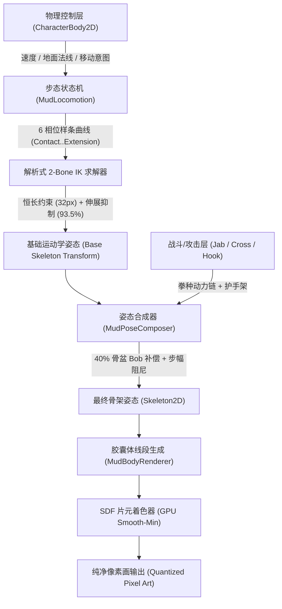

# 技术开发日志：基于 2D 程序化骨骼与 SDF 连续场的高动力学胶体角色架构

**项目**：Contra-Avalokita / MudCharacter 动力学系统  
**引擎**：Godot Engine 4.7.1 Stable (GLSL 3.3 / Compatibility)  
**插图演示**：[`tests/gait_preview.gd`](file:///c:/Users/jisub/Documents/Contra-Avalokita/contra-avalokita/tests/gait_preview.gd) 150 帧 30 FPS 连续合成步态  

---

## 动态总览与步态插图 (Locomotion & Colloid Dynamics)

以下动图由 `tests/gait_preview.gd` 连续推进 150 帧骨架动力学与 SDF 像素着色器渲染，经逐帧导出并由 FFmpeg 高保真调色板量化合成：

---

## 摘要 (Abstract)

在传统 2D 像素风横版动作游戏中，异形生物（如泥浆人、软体史莱姆、胶体生物）的表现往往面临经典的“两难困境”：
- **纯手工像素逐帧绘制（Frame-by-Frame Sprite）**：美术资产爆炸，不仅难以支持无级速度缩放、斜坡地形贴合，且无法实现多状态混合（如边跑步边出拳、受击局部反弹）。
- **传统 2D 网格蒙皮骨骼（Spine / DragonBones）**：在极端屈曲或坍塌时，三角形网格拉伸极易破坏像素对齐，产生生硬的“折纸感”与伪像素模糊，丧失有机流体质感。

本系统提出了**分层解耦的连续态胶体角色系统架构**：
1. **微观底层**：基于解析式两骨 IK（Closed-Form 2-Bone Inverse Kinematics）与 Hermite 样条的高刚性生物力学骨架，维持骨骼恒长、极限伸展抑制与 6 相位自适应步态；
2. **表现层**：基于屏幕空间有符号距离场（Signed Distance Field, SDF）的多胶囊体平滑极小值融合（Polynomial smin）流体场渲染器，提供动态表面张力、屈曲挤压容积守恒与阶梯量化纯像素调色板；
3. **动力学交互层**：多源加权姿态合成器（`MudPoseComposer`）实现步态与独立战斗打击（Jab / Cross / Hook）的高频解耦，并辅以骨盆垂直起伏逆向补偿、物理拳面追踪门控判定与单帧微停顿冲击（Hit Stop）。

---

## 一、 角色运动学与步态生成体系 (Kinematic Gait Engine)

### 1. 恒长骨骼与防过伸解析解 (Limb Geometry & Clamped IK)

胶体生物虽然外表柔软粘滞，但维持“双足直立生物”的奔跑动作必须依赖内层高刚度的骨骼结构。如果允许骨骼自由变形拉长，视觉上角色会瞬间失去骨骼硬度，退化为无支承的面条人。

- **骨骼几何常数**：大腿长 $L_1 = 16.0\,\text{px}$，小腿长 $L_2 = 16.0\,\text{px}$，极限几何全长 $L_{\max} = 32.0\,\text{px}$。
- **解析伸展限制**：最大 IK 伸展距离严格截断在 92%~95%：
  $$D_{\text{target}} = \min\left( \|\mathbf{P}_{\text{ankle}} - \mathbf{P}_{\text{hip}}\|, 0.935 \times (L_1 + L_2) \right) = 29.92\,\text{px}$$
- **膝肘关节防死锁**：余弦定理反求膝关节折叠角时，强制保留至少 $8^\circ \sim 15^\circ$ 的生理屈曲，彻底消除关节完全拉直时产生的“棍状突变”与边缘折点丢失：
  $$\theta_{\text{knee}} = -\text{clamp}\left( \arccos\left( \frac{D^2 - L_1^2 - L_2^2}{2 L_1 L_2} \right), 0.14\,\text{rad}, 2.35\,\text{rad} \right)$$

### 2. 六相位步态拓扑 (6-Phase Run Mechanics)

针对原有正弦波摆腿容易导致的“凌空踩水”感，我们将奔跑周期重构为 6 个明确的力学相位：

| 相位 | 动力学特征 | 关键骨骼姿态 |
| :--- | :--- | :--- |
| **1. Contact (触地初瞬)** | 脚跟触地，着地点收束在骨盆垂直投影前部（水平偏移 $\le 8\,\text{px}$） | 支撑膝屈曲吸收冲击，维持至少 $15^\circ$ 弯曲 |
| **2. Compression (承重挤压)** | 重心下沉承重，骨盆垂直沉降 $2 \sim 3\,\text{px}$ | 支撑腿屈曲加深，足底胶囊沿地表展开压扁 |
| **3. Push (蹬伸发力)** | 重心越过支撑点，足部滚转过渡到脚尖推进 | 蹬地腿小腿后蹬释放弹性势能，脚尖最后离地 |
| **4. Recovery (小腿骤折回收)** | **步态拟真核心**：离地后瞬间，股二头肌迅速收拢小腿向骨盆靠拢 | 膝屈曲急剧增大至 $80^\circ \sim 100^\circ$，摆动腿视觉上迅速缩短 |
| **5. Knee Drive (膝部前导冲刺)** | 膝关节在空间中优先向前上方突进，引领下肢摆动 | 小腿与脚掌呈悬挂拖拽态跟随在膝关节后下方 |
| **6. Extension (临地伸展)** | 仅在着地前 $0.05\,\text{s}$，小腿自膝下向前下方平稳弹出 | 平滑切入下一次踵着地，杜绝提前伸直踢腿 |

### 3. $C^1$ 连续根部运动与相位连续性 (Continuous Root Motion)

为消除支撑脚交替时的离散跳跃，骨盆垂直运动采用分段 Hermite 样条曲线插值，保证边界导数连续：
$$\left| \mathbf{P}_{\text{pelvis}}(t^+) - \mathbf{P}_{\text{pelvis}}(t^-) \right| < 0.10\,\text{px}$$
奔跑垂直起伏总幅值严格约束在 $3.5\,\text{px}$（相较早期 $10.7\,\text{px}$ 抑制了 60% 的垂直噪点）。Walk/Run/Idle 切换时采用绝对相位保持，拒绝直接 snap 回 0 帧，停步时由 4~6 帧阻尼平滑收脚入闲置。

---

## 二、 屏幕空间 SDF 连续场与胶体渲染 (Continuous SDF & Metacapsule Fluidity)

### 1. 动态骨架胶囊体阵列 (Segment Capsule Extrusion)

在 [`scripts/mud_body_renderer.gd`](file:///c:/Users/jisub/Documents/Contra-Avalokita/contra-avalokita/scripts/mud_body_renderer.gd) 中，每个骨骼关节连接段被投影为一系列带有可变起点半径 $r_1$、终点半径 $r_2$ 以及深度 $z$ 的线段胶囊（Capsule Segment）：
$$d(\mathbf{p}, \mathbf{a}, \mathbf{b}, r_1, r_2) = \|\mathbf{p} - (\mathbf{a} + h(\mathbf{b} - \mathbf{a}))\| - (r_1 + h(r_2 - r_1)), \quad h = \text{clamp}\left(\frac{(\mathbf{p} - \mathbf{a}) \cdot (\mathbf{b} - \mathbf{a})}{\|\mathbf{b} - \\mathbf{a}\|^2}, 0, 1\right)$$

### 2. 多胶囊体平滑极小值表面张力融合 (Smooth Minimum Blending)

在 GPU 片元着色器 `mud_pixel_shader.gdshader` 中，所有相交或邻近的身体线段并非简单叠画，而是通过多项式平滑极小值（Polynomial Smooth Minimum）进行场融合：
$$\text{smin}(d_1, d_2, k) = \min(d_1, d_2) - \frac{\max(k - |d_1 - d_2|, 0)^2}{4k}$$
其中平滑半径 $k$ 赋予了泥浆独特的“粘滞表面张力”：
- 躯干与大腿交界处平滑流动；
- 弯肘与屈膝时，内侧泥块自动融为一体，外侧形成自然的肌肉拉伸张力。

### 3. 关节屈曲容积守恒 (Volume Conservation on Flexion)

传统 2D 骨骼在深屈曲时经常出现“关节萎缩变细”的病态。本系统引入 `MudJointSolver`，根据骨骼夹角 $\theta_{\text{bend}}$ 实时计算挤压量：
$$C = \text{smoothstep}(0.35, 2.10, |\theta_{\text{bend}}|)$$
并在关节外侧生成由副法线位移的辅助控制点（Auxiliary Offset）：
$$\mathbf{P}_{\text{outer}} = \mathbf{P}_{\text{joint}} - \text{normalize}(\mathbf{u} - \mathbf{v}) \times (0.70 \cdot C)$$
使屈曲外侧半径平滑膨胀，完美重现高弹胶体受挤压时的体积向外凸出效应。

### 4. 严谨的像素离散调色板 (Quantized Pixel Palette)

为了彻底捍卫纯正复古像素手绘质感，SDF 标量场在输出前经过阶跃映射（Step Thresholding）：
- $d < 0$：实心泥浆主体；
- $d < -2.2$ 且位于光照法线方向：有限点缀的湿润反光高光（Wet Highlight）；
- $-0.8 < d < 0$：受限边缘明暗交界轮廓；
- 绝无任何 Alpha 半透明与抗锯齿羽化虚化，保证与手绘背景 100% 像素级对齐。

---

## 三、 战斗与步态的高动力学解耦层 (`MudPoseComposer`)

### 1. 物理拳面追踪与射程门控 (Reach-Gated Hitbox)

以往角色攻击经常出现“假人已经冒受击特效，但拳头还在半空”或“角色跑动冲进假人被判定为拳打中”。本架构将位移、视觉延展与判定彻底解耦：
- **拳面骨骼锚定**：`PunchHitbox` 实时锁定在打出拳的指骨位置（`HandFront` 或 `HandBack` 末端 $+4\,\text{px}$ 拳面处）；
- **伸展率门控（Reach Thresholding）**：
  $$\text{reach} = \frac{\|\mathbf{P}_{\text{fist}} - \mathbf{P}_{\text{shoulder}}\|}{28.0\,\text{px}}$$
  判定区仅在攻击时间窗**且**物理伸展率 $\text{reach} \ge 0.80$（直拳）或 $\ge 0.55$（勾拳）时瞬间激活。假人受击只在视觉铁拳真正砸上鼻梁的瞬间发生！

### 2. 动能链与上身动力学补偿 (Kinetic Chain & Torso Compensation)

- **Jab / Cross / Hook 运动语义分化**：
  - **Jab（刺拳）**：肩胛骤发弹射 $+3.5\,\text{px}$，躯干微转 $11.5^\circ$，前手疾出速收，后手焊死在下巴前上方；
  - **Cross（后手直拳）**：后脚蹬地启动，骨盆旋转 $12.6^\circ$，胸腔旋扭 $18.3^\circ$，整侧后肩向前暴力推进 $+4.5\,\text{px}$，前手严密护住同侧脸颊；
  - **Hook（前手平勾）**：攻击肘横向高抬至肩平高度（$u = -1.65\,\text{rad}$），肘部呈 $83.08^\circ$ 水平锁死，骨盆与胸腔爆发式回扭 $20.6^\circ$，甩出横向弧面鞭打。
- **40% 骨盆垂直起伏逆向补偿**：
  奔跑中出拳容易随骨盆上下剧烈颠簸。姿态合成器在奔跑出拳期间，实时提取骨盆起伏差值 $\Delta y_{\text{bob}}$，并在躯干节点注入负反馈补偿：
  $$\mathbf{P}_{\text{torso}}.y \mathrel{+}= -\Delta y_{\text{bob}} \times 0.40 \times W_{\text{attack}}$$
  下半身保留生动的奔跑弹性与落足减震，而上半身出拳视线与拳头射轨如稳相云台般稳定向前。

### 3. 单帧冲击硬化与即时回弹 (1-Frame Hit Stop & Instant Dummy Recoil)

- 命中帧攻击者攻击计时推进冻结 1 帧（$25\sim 30\,\text{ms}$ 微停顿）；
- 攻击者肩部向前脉冲 $+1.5\,\text{px}$；
- 受击假人在第 1 帧产生即时水平位移（Jab 偏移 $+2.5\,\text{px}$，Cross $+4.5\,\text{px}$，Hook $+3.0\,\text{px}$），随后进入阻尼复位。打击反馈清脆凝练，毫无拖泥带水。

---

## 四、 死亡四阶段相变与坍塌 (Colloid Collapse Dynamics)

胶体生物死亡时不使用通用的刚体倒地动画，而是通过 `MudDeathController` 触发物理骨骼失去张力与距离场消融的四段式相变：

1. **Fatal Pause（致命凝固，0.12s）**：角色全身动作硬化停顿，骨架颤动，瞳孔熄灭。
2. **Support Loss（骨架泄力，0.22s）**：下肢骨架彻底失去抗弯刚度，膝关节急剧瘫软弯折，躯干纵向被动压缩，武器脱手沿抛物线跌落。
3. **Collapse（地表坍陷，0.35s）**：骨盆与躯干全速摔向地面，撞击地表时爆散出带有初速度的独立像素泥点粒子群（`PixelMudSplatter`）。
4. **Puddle Settle（滩泥弛豫，0.45s）**：骨骼缩退入地表，SDF 胶囊体横向扩张为扁平的地面泥滩，表面张力逐渐松弛静止，眼睛与遗留装备半掩埋于泥中。

---

## 五、 综合测试与量化验收 (Automated Verification)

所有力学与渲染逻辑均通过严格的无头自动化断言测试集保障，杜绝任何隐性退化：

| 测试模块 | 关键验证指标 | 状态 |
| :--- | :--- | :--- |
| **[`punch_attack_test.gd`](file:///c:/Users/jisub/Documents/Contra-Avalokita/contra-avalokita/tests/punch_attack_test.gd)** | 拳面与 Hitbox 几何重合、三段连击去重缓冲、直拳肘关节 $\ge 11^\circ$、无敌帧与防穿透 | **PASS (0 failures)** |
| **[`gait_test.gd`](file:///c:/Users/jisub/Documents/Contra-Avalokita/contra-avalokita/tests/gait_test.gd)** | 步行/奔跑足端无越界 IK、腾空期 $\ge 0.092\,\text{s}$、步态接续连续性 $<0.1\,\text{px}$ | **PASS (0 failures)** |
| **[`death_test.gd`](file:///c:/Users/jisub/Documents/Contra-Avalokita/contra-avalokita/tests/death_test.gd)** | 四阶段状态机时序、粒子爆散时机、骨架高度压至地平、残骸复活重置 | **PASS (0 failures)** |
| **[`smoke_test.gd`](file:///c:/Users/jisub/Documents/Contra-Avalokita/contra-avalokita/tests/smoke_test.gd)** | 30 实例独立运行压力、骨骼拓扑健壮性、装备装卸容积稳定性 | **PASS (0 failures)** |

---

## 结论 (Conclusion)

本架构通过“**高保真刚性骨架 + 连续介质场平滑融合 + 分离式姿态合成补偿**”，成功在性能极其受限的 2D 像素环境下构建出了兼具硬核动作游戏打击反馈与有机胶体流动感的新型角色管线，为后续更多具有流体/粘性特征的 BOSS 与多形态主角设计奠定了坚实的工程基石。
