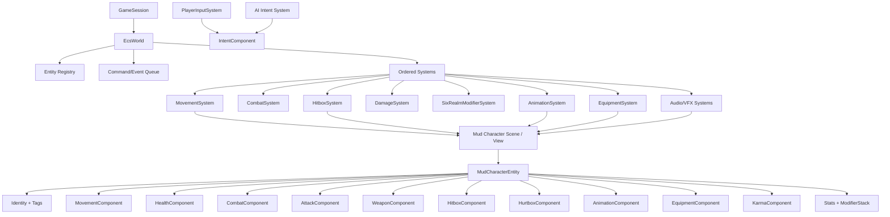

# Contra-Avalokita ECS 渐进迁移计划

状态：提案，尚未切换运行时所有权  
前提：保留当前可运行版本；不一次重写；不直接删除旧代码；每个迁移 PR 必须独立可运行、可回滚。  
审计依据：`docs/ARCHITECTURE_AUDIT.md`

## 1. 为什么迁移

当前应用层分层已经可用，但角色运行时仍以 `MudCharacter` 为中心。输入、移动、墙面动作、攻击、格挡、受击、生命、韧性、死亡、动画、装备、武器、渲染和计分形成一个共享可变状态团。继续在这一结构上增加 Enemy、Boss、NPC、六道成长和更多武器，会产生三类成本：

- 同一规则在 Player、Enemy、Boss、Dummy 中复制；
- 一处状态变化需要同时修改角色、武器、动画和表现脚本；
- 测试必须实例化完整 7384 行角色 Scene 才能验证简单的伤害或属性公式。

迁移目标不是消灭 Godot Scene。Scene 继续负责 Node、碰撞、Sprite/Skeleton、AnimationPlayer 和视听表现；ECS 负责游戏事实、规则和跨实体处理。

## 2. 目标原则

### Entity

- 只保存稳定 `entity_id`、tags、组件集合和 Scene host 绑定；
- 不读取 Input，不进行攻击/伤害/成长计算，不推进 Animation；
- 不实现每帧游戏规则；
- Player、Enemy、Boss、NPC 是组件组合和控制源的差异，不是四套角色基类。

### Component

- 使用 `Resource` 表达可编辑、可序列化的纯数据；不实现 `_process`、规则计算或跨实体调用；
- 运行时可变组件必须 entity-local，禁止多实例共享同一 Resource；
- Component 不持有具体 `MudCharacter` 引用；对 Scene 节点只保存 NodePath/语义 socket ID；
- 一次性事实（AttackRequested、HitConfirmed、Died）使用 command/event queue，不长期塞入 Component。

### System

- 由 `GameSession/EcsWorld` 持有，按固定顺序处理多个 Entity；
- 通过组件签名查询实体，不用 `get("health")`、metadata 或 `has_method("receive_hit")`；
- 一个运行时字段只有一个 System 是 writer，其他 System 只读或提交 command；
- System 不依赖 Player 场景；Player/AI 都只产生 Intent。

### View / Engine Binding

- `CharacterBody2D`、Area2D、Skeleton2D、AnimationPlayer、AudioStreamPlayer 和 VFX Node 保留在 Scene；
- System 通过 binding 数据解析 Node，不把 Node 本身当纯数据组件；
- Presenter 只能消费 ECS 状态，不反向计算 Damage、Stats 或 Attack 结果。

## 3. 新架构图



建议固定更新顺序：

```text
Time/Hitstop
  -> PlayerInput + AI Intent
  -> SixRealm/Item Modifier aggregation
  -> DerivedStats
  -> Movement/WallMovement
  -> Combat/Attack state
  -> Hitbox overlap collection
  -> Damage/Block/Poise/Death
  -> Status timers
  -> Animation/Pose
  -> Equipment/Weapon presentation
  -> Audio/VFX/UI event consumers
```

DamageSystem 处理本帧 hit command 后，AnimationSystem 才读取 reaction/death 状态，可以保持当前“受击层覆盖墙 IK/攻击层”的视觉所有权。

## 4. 推荐目录树

以下是目标树，不要求第一批 PR 一次创建全部空目录。只在有首个真实文件时创建目录。

```text
res://
├── bootstrap/
├── core/
│   ├── app/
│   ├── content/
│   ├── debug/
│   ├── events/
│   ├── save/
│   ├── settings/
│   └── ecs/
│       ├── entity.gd
│       ├── component.gd
│       ├── system.gd
│       ├── ecs_world.gd
│       ├── entity_query.gd
│       └── command_queue.gd
├── gameplay/
│   ├── session/
│   ├── world/
│   ├── entities/
│   │   ├── player/
│   │   │   └── player_controller_profile.tres
│   │   ├── enemy/
│   │   ├── boss/
│   │   ├── npc/
│   │   └── mud/
│   │       └── mud_character_entity.gd
│   ├── components/
│   │   ├── identity/
│   │   │   ├── faction_component.gd
│   │   │   └── score_credit_component.gd
│   │   ├── movement/
│   │   │   ├── intent_component.gd
│   │   │   ├── movement_component.gd
│   │   │   ├── movement_assist_component.gd
│   │   │   └── wall_movement_component.gd
│   │   ├── combat/
│   │   │   ├── combat_component.gd
│   │   │   ├── attack_component.gd
│   │   │   ├── block_component.gd
│   │   │   ├── weapon_component.gd
│   │   │   ├── hitbox_component.gd
│   │   │   ├── hurtbox_component.gd
│   │   │   └── reaction_component.gd
│   │   ├── stats/
│   │   │   ├── health_component.gd
│   │   │   ├── stats_component.gd
│   │   │   ├── stability_component.gd
│   │   │   ├── status_component.gd
│   │   │   ├── stat_modifier.gd
│   │   │   └── modifier_stack_component.gd
│   │   ├── inventory/
│   │   │   ├── inventory_component.gd
│   │   │   └── equipment_component.gd
│   │   ├── animation/
│   │   │   ├── animation_component.gd
│   │   │   ├── pose_component.gd
│   │   │   └── skeleton_binding_component.gd
│   │   └── roguelike/
│   │       ├── karma_component.gd
│   │       └── rogue_stats_component.gd
│   ├── systems/
│   │   ├── input/
│   │   │   └── player_input_system.gd
│   │   ├── ai/
│   │   │   └── ai_intent_system.gd
│   │   ├── movement/
│   │   │   ├── movement_system.gd
│   │   │   └── wall_movement_system.gd
│   │   ├── combat/
│   │   │   ├── combat_system.gd
│   │   │   ├── hitbox_system.gd
│   │   │   ├── damage_system.gd
│   │   │   └── hitstop_system_adapter.gd
│   │   ├── stats/
│   │   │   ├── derived_stats_system.gd
│   │   │   └── status_system.gd
│   │   ├── animation/
│   │   │   └── animation_system.gd
│   │   ├── equipment/
│   │   │   └── equipment_system.gd
│   │   ├── roguelike/
│   │   │   └── six_realm_modifier_system.gd
│   │   └── presentation/
│   │       ├── audio_system.gd
│   │       └── vfx_system.gd
│   ├── definitions/
│   │   ├── attacks/
│   │   ├── weapons/
│   │   ├── stats/
│   │   └── realms/
│   └── factories/
│       └── entity_factory.gd
├── scenes/
│   ├── entities/
│   │   ├── characters/
│   │   └── props/
│   ├── levels/
│   ├── test/
│   ├── weapons/
│   ├── equipment/
│   └── fx/
├── assets/
│   ├── characters/
│   ├── weapons/
│   ├── equipment/
│   ├── effects/
│   ├── environments/
│   └── fonts/
├── content/
├── addons/
├── tests/
│   ├── ecs/
│   ├── character/
│   ├── combat/
│   └── integration/
└── scripts/                  # 迁移期间保留的兼容层，最终只留明确的 legacy adapters
```

为什么 `core/ecs` 而不是根级 `ecs/`：Entity/Component/System 基类是领域无关基础设施，放在 Core 可以保持 `gameplay` 单向依赖。若团队强制采用用户给定的 `res://ecs/`，也可以整体平移，关键是 Core/ECS 不得依赖 Mud、武器或六道类型。

## 5. ECS 基础契约

### 5.1 `EcsComponent`

建议 `extends Resource`，只提供 component type ID 和可复制数据。基类不包含 update 行为。每个运行时实例必须满足以下之一：

- 内嵌于 Scene 且 `resource_local_to_scene = true`；
- 由 EntityFactory 从 definition `duplicate(true)`；
- 在 Entity 创建时 `new()`。

禁止把同一个带 `current_health`、timer、combo index 的 `.tres` 挂到多个 Entity。

### 5.2 `EcsEntity`

建议作为角色 View 根节点下的普通 `Node`，而不是强制所有 Entity 继承 `CharacterBody2D`。字段只包含：

```text
entity_id: int/StringName
archetype_id: StringName
tags: Array[StringName]
components: Array[EcsComponent]
host_path: NodePath（通常为 ".."）
```

`MudCharacterEntity` 只校验必需组件和 binding，不执行移动/攻击/伤害。物理 host 可由 `entity.host as CharacterBody2D` 提供给 MovementSystem。

### 5.3 `EcsSystem`

System 声明 required component types、执行顺序和 update phase。`EcsWorld` 在 Entity 注册/组件变化时维护 query cache，避免每帧全 SceneTree 搜索。

### 5.4 Command/Event

建议最少提供：

- `MoveIntentCommand`
- `AttackRequestCommand`
- `BlockIntentCommand`
- `EquipCommand`
- `HitCandidateEvent`
- `HitConfirmedEvent`
- `DamageAppliedEvent`
- `ReactionStartedEvent`
- `EntityDiedEvent`
- `AnimationMarkerEvent`

事件 payload 使用 `entity_id` 和纯数据，不用 `Node` 作为跨系统长期引用。Scene Node 只在本地 binding 阶段解析。

## 6. MudCharacter 拆分目标

### 6.1 Entity Scene

迁移完成后的角色 Scene 仍可使用 `CharacterBody2D` 根节点，但根脚本仅是 View host 或完全无脚本：

```text
MudCharacterView (CharacterBody2D)
├── CollisionShape2D
├── ECS (MudCharacterEntity)
│   └── components: [Movement, Health, Combat, Animation, Equipment, RogueStats, ...]
├── Bindings
│   ├── Hurtbox (Area2D)
│   ├── WeaponSocket(s)
│   └── AnimationPlayer
└── Visual
    ├── Sprite/SDF Renderer
    ├── Skeleton2D
    ├── Equipment View
    └── FX sockets
```

Scene 负责引用和表现，不负责攻击计算、伤害计算、属性成长或武器规则。

### 6.2 组件职责

| Component | 只保存的数据 |
|---|---|
| MovementComponent | velocity、base speed/acceleration/gravity、grounded、facing |
| MovementAssistComponent | coyote/buffer timer、倍率、pending jump source |
| WallMovementComponent | wall side、surface、action phase、timers、anchors、same-wall counter |
| HealthComponent | max/current health、invulnerable、dead flag |
| StabilityComponent | max/current poise、recovery、cooldown |
| CombatComponent | combat enabled、team/faction、current target、cooldowns |
| AttackComponent | attack definition ID、phase、elapsed、combo index、queued、serial |
| BlockComponent | requested/active、facing policy、damage/poise multipliers |
| ReactionComponent | tier、elapsed/duration、direction、region、intensity、push |
| AnimationComponent | locomotion/action/reaction requests、active clip、normalized time、layer ownership |
| SkeletonBindingComponent | AnimationPlayer/Skeleton/PoseRoot/socket NodePaths 与语义 bone map |
| EquipmentComponent | slot → content ID、visible/equipped state |
| WeaponComponent | equipped weapon definition、runtime cooldown、owner entity ID |
| HitboxComponent | binding path、shape profile ID、team mask、enabled、already-hit entity IDs |
| HurtboxComponent | binding path、team、region、enabled、damage multiplier |
| StatsComponent | 生命/力量/速度/跳跃/防御/迅捷的 base 与 derived 值 |
| ModifierStackComponent | 有序 StatModifier 列表和 dirty revision |
| KarmaComponent | 六道倾向/等级/点数、已激活 realm modifier source IDs |
| InventoryComponent | content IDs、stack/count、容量；不计算移动公式 |

### 6.3 System 职责

| System | 唯一写入职责 |
|---|---|
| PlayerInputSystem | 把 Input 转为 Intent/command；不移动角色 |
| AIIntentSystem | 把 AI 决策转为同一种 Intent；不调用 MudCharacter |
| MovementSystem | 普通地面/空中速度、jump、`move_and_slide` |
| WallMovementSystem | WallHang/Slide/Push/Release 状态和 launch 结果 |
| CombatSystem | attack1/2/3、combo、block request、攻击窗口与 attack commands |
| HitboxSystem | 激活 binding、收集 overlap、过滤 owner/team、产生 HitCandidate |
| DamageSystem | block、health、defense、stability、reaction、knockback、death event |
| DerivedStatsSystem | base + modifier stack → derived stats |
| SixRealmModifierSystem | 根据 Karma 添加/移除来源明确的 StatModifier |
| AnimationSystem | gameplay state → clip/layer/pose；调用现有 PoseComposer backend |
| EquipmentSystem | 装备数据、武器实例和 slot 状态；表现挂点交给 presenter |
| Audio/VFX System | 消费 hit/reaction/death/footstep events；不修改 Damage 结果 |

## 7. 战斗数据设计

### 7.1 AttackDefinition

把 Punch/Blade 的三段数组变成内容定义：

```text
id
animation_tag
duration 或 timing_source
active_windows[]
damage
poise_damage
impact_force
hit_type
hit_region
movement_multiplier
combo_next_ids[]
combo_buffer_window
hitbox_profile_id
feedback_profile_id
```

Player、Enemy、Boss 只要装备/引用同一 AttackDefinition，就由同一 CombatSystem 处理。Animation clip 名是 presentation mapping，不应作为攻击的稳定 ID。

### 7.2 WeaponDefinition 与 WeaponComponent

`WeaponDefinition` 是不可变内容：攻击集合、伤害类型、Hitbox profile、显示 Scene、socket、trail/feedback profile。`WeaponComponent` 是每实体运行时数据：equipped definition ID、cooldown、durability（如需要）。`scenes/weapons/sword.tscn` 变成 Weapon View，不再构造 Damage 或调用目标。

### 7.3 Hitbox/Hurtbox

迁移后 Area2D 只上报 overlap：

```text
Area2D overlap
  -> HitboxSystem resolves hitbox entity/component
  -> faction/self/already-hit filter
  -> HitCandidateEvent
  -> CombatSystem confirms attack window and builds HitConfirmedEvent
  -> DamageSystem resolves block/defense/health/poise/reaction/death
```

兼容期可继续保留 `owner_character` metadata 和 `receive_hit()` fallback，但新路径应优先使用 `entity_id` metadata；所有真实 ECS Entity 迁完后再删除 fallback。

## 8. 六道与通用 Modifier

### 8.1 数据模型

`KarmaComponent` 不直接持有 Player，也不写 Movement/Health：

```text
realm_weights:
  deva
  asura
  preta
  animal
  human
  naraka
karma_total
revision
active_sources[]
```

`StatModifier`：

```text
source_id: StringName       # six_realm:asura_tier_2 / item:hermes_boots
stat_id: StringName         # health/strength/speed/jump/defense/agility
operation: ADD | MULTIPLY | OVERRIDE | CLAMP_MIN | CLAMP_MAX
value: float
priority: int
tags: Array[StringName]
duration: float             # -1 表示持久
stack_policy: REPLACE | STACK | MAX
```

### 8.2 确定性计算

DerivedStatsSystem 使用固定顺序：

```text
base
  -> ADD（按 priority/source_id 排序）
  -> MULTIPLY
  -> OVERRIDE
  -> CLAMP_MIN / CLAMP_MAX
  -> derived value
```

SixRealmModifierSystem 只根据 Karma revision 同步 `source_id` 前缀为 `six_realm:*` 的 modifiers。Item、装备、Buff、Debuff 使用同一 Stack，但由不同 source ID 管理。这样六道不会直接改 Player，存档也只需保存 Karma 与持久 modifier 来源，derived stats 可重建。

### 8.3 现有内容迁移

- 保留 `SixRealmGlyphs` 为 UI/VFX 工具；
- 保留 `ScoreSystem.resonance()` 行为，之后改读 Karma/Realm policy definition；
- Save Schema 的 `character_karma` 通过 migrator 升级为结构化数据，旧整数值仍可映射；
- `MudItemInventory.aggregate_movement_modifiers()` 先适配为通用 StatModifier，再由 DerivedStatsSystem 计算，不直接调用 MovementAssist。

## 9. 文件迁移表

| 当前文件/职责 | 过渡策略 | 目标位置/所有者 | 风险 |
|---|---|---|---|
| `scripts/mud_character.gd` | 保留 facade；逐块把 getter/setter 转发到组件和 command | `gameplay/entities/mud/mud_character_entity.gd` + Systems | 高 |
| `scenes/mud_character.tscn` | 原地挂 ECS Entity 与 component subresources；行为稳定后再复制到规范路径 | `scenes/entities/characters/mud_character.tscn` | 高 |
| Player Input 分支 | 先抽 controller 调用原 `set_intent()`，再改写 IntentComponent | `systems/input/player_input_system.gd` | 低 |
| `set_intent()` 状态 | facade 同步到 IntentComponent，AI/Player 共用 | `intent_component.gd` | 低 |
| 普通移动字段/公式 | shadow component 对比；一次切换 velocity writer | `movement_component.gd` + `movement_system.gd` | 高 |
| 墙面字段/公式 | 保持当前测试；整块切换，避免拆成多个 writer | `wall_movement_component.gd` + `wall_movement_system.gd` | 高 |
| `MudMovementAssist` | 先保留为 MovementSystem backend，数据镜像后再纯化 | `movement_assist_component.gd` | 中 |
| 徒手攻击数组与方法 | 转为 3 个 AttackDefinition；legacy facade 提交 command | `definitions/attacks/` + `combat_system.gd` | 高 |
| `gameplay/combat/weapons/weapon.gd` | 分离 definition/view；先只改命中分发 | `weapon_component.gd` + Weapon View + Systems | 高 |
| `scripts/weapon_manager.gd` | 先包装为 presenter；装备真值转入 EquipmentComponent | `equipment_system.gd` + presenter | 中 |
| `scripts/hit_event.gd` / `HitData` | 保持兼容类型；新增 entity IDs，逐步减少 Node 字段 | `gameplay/combat/events/` 或 command queue DTO | 中 |
| Character `receive_hit()` | 先委托 DamageSystem，保留同名 facade 给 legacy Hitbox | `damage_system.gd` | 高 |
| Character Hurtbox / PunchHitbox | 添加 entity ID binding，保留 metadata fallback | `hitbox_component.gd` / `hurtbox_component.gd` | 中 |
| 两类 Dummy 受击逻辑 | 先迁 Dummy 验证共享 DamageSystem，再切 MudCharacter | 通用 Entity components | 低至中 |
| `HitstopManager` | 第一阶段原样保留；用 adapter 消费 HitConfirmed | `hitstop_system_adapter.gd`，最终可取消 Autoload | 低 |
| `MudPoseComposer` | 先接受 PoseInput DTO 而非 Character；作为 AnimationSystem backend | `animation_system.gd` + pose backend | 高 |
| `MudWallPoseComposer` | 输入改为纯 WallPoseInput，去除 MudCharacter 类型 | animation/pose backend | 中 |
| `MudDeathController` | DamageSystem 只发 death event；现脚本改成 DeathPresenter | presentation/death | 中 |
| `_sync_visual()` | 按 Renderer/Animation/Equipment/VFX 分消费者 | presentation systems | 高 |
| `MudBodyRenderer` | 保留纯表现实现；禁止规则直接写 renderer | renderer presenter | 中 |
| `EquipmentManager` | 数据与 Scene 实例化分离 | EquipmentComponent/System + view | 中 |
| `MudItemInventory` | 保留 API；输出通用 modifiers | InventoryComponent + ModifierStack | 中 |
| `kill_score.gd` | 用组件查询替代反射字段 | `ScoreSystem` | 中 |
| `CommandRegistry` | 命令提交到 Session/ECS，不访问 scene.player 字段 | core debug adapter | 低至中 |
| `scripts/weapon.gd` 等 stub | 迁移全引用后再保留一到两个发行周期 | legacy compatibility | 低 |
| `assets/` | ECS 稳定后按资源域移动并依赖 UID/重导入验证 | `assets/characters|weapons|effects` | 中但非功能优先 |

## 10. 分阶段迁移

### Phase 0：基线与边界（不改变行为）

- 记录现有 headless test 命令和通过基线；
- 为 Entity ID、component lifecycle、query cache、Resource 独占性编写测试；
- 给现有 HitEvent 增加可选 attacker/victim entity ID，但保持 Node 字段兼容；
- 修复遗留的 `wall_movement_test.tscn` 引用问题，使用独立 PR。

退出条件：主场景启动；现有测试不变；ECS kernel 测试通过。

### Phase 1：Shadow ECS

- `GameSession` 创建 `EcsWorld` 和有序系统列表；
- 在现有 Mud Scene 中挂 `MudCharacterEntity` 和组件资源；
- `LegacyCharacterSyncAdapter` 只把旧字段镜像到组件，System 不写 gameplay 状态；
- 添加每帧/关键事件一致性断言，比较 health、velocity、attack phase、wall phase。

退出条件：关闭或打开 shadow ECS 都得到相同行为；无新 writer。

### Phase 2：输入与身份

- 抽出 PlayerInputSystem；先调用旧 `set_intent()`；
- AIIntentSystem 写同一 IntentComponent；
- faction、score credit、player ownership 由组件表达；
- Pickup 和 CommandRegistry 不再通过 `player_controlled` 猜身份。

退出条件：Player/AI 控制源可互换；MudCharacter 不直接调用 Input。

### Phase 3：Hitbox/Hurtbox 与 Damage

- 先把 Dummy 迁到通用 Health/Stability/Hurtbox/Reaction 组件；
- HitboxSystem 统一 owner/team/already-hit 过滤；
- DamageSystem 处理 block、defense、health、poise、reaction、death；
- `MudCharacter.receive_hit()` 暂时成为向 DamageSystem 提交 command 的 facade。

退出条件：Player、Mud Enemy、两个 Dummy 使用同一 DamageSystem；旧方法仅是兼容入口。

### Phase 4：Attack/Weapon/Equipment

- 三段 Punch/Blade 转为 AttackDefinition；
- CombatSystem 拥有 attack clock、combo 与 active window；
- Weapon Scene 只做 View/Area binding；
- EquipmentSystem 拥有装备真值，WeaponManager 降为挂点 presenter。

退出条件：Player/Enemy/Boss fixture 可共享同一攻击和武器定义；Weapon 不调用 receive_hit。

### Phase 5：Movement/Wall Movement

- 先普通移动，后墙面动作；每个子阶段只允许一个 velocity writer；
- MovementAssist 数据迁到组件；
- WallHang/Slide/Push/Release 整块迁移并保持现有 600-frame 墙滑测试。

退出条件：MudCharacter `_physics_process()` 不再计算 movement；AI/Player 只写 Intent。

### Phase 6：Animation/Pose/Presentation

- AnimationSystem 根据组件状态生成 AnimationRequest/PoseInput；
- PoseComposer 改为接收 DTO，不再接收 `MudCharacter`；
- `_sync_visual()` 分成 animation、renderer、equipment、VFX 消费者；
- 最后外置内嵌 AnimationLibrary，避免前期产生巨大 Scene diff。

退出条件：Animation 不计算 Damage/Attack；Combat 不直接调用 AnimationPlayer；姿势层所有权测试全部通过。

### Phase 7：Karma/六道与统一属性

- 建立 Stats/ModifierStack/DerivedStats；
- 把 Coyote item 迁到通用 modifier；
- 实现 SixRealmModifierSystem；
- 升级 Save Schema，并保留旧 `character_karma` 迁移。

退出条件：六道、物品、装备、Buff 通过同一 modifier 管线影响六项属性；任何 System 都不直接修改 Player 专有字段。

### Phase 8：收尾

- 新旧行为跑一个稳定周期后删除 legacy writer；
- compatibility stub 保留明确期限；
- 移动 Scene/Assets，依靠 Godot UID 和全量资源加载测试验证；
- 更新 mod API、save docs 和 content definitions。

## 11. 第一批低风险迁移 PR

这些 PR 均不删除旧代码，建议严格按顺序提交；每个 PR 都应小于后续行为切换 PR。

### PR 1 — ECS Kernel 与单元测试（无 gameplay writer）

范围：

- 新增 `core/ecs/component.gd`、`entity.gd`、`system.gd`、`ecs_world.gd`、`command_queue.gd`；
- 新增注册/注销、组件查询、执行顺序、事件清空、Resource 独占测试；
- `GameSession` 可选创建 EcsWorld，但不注册现有角色，不改变运行时行为。

验收：现有启动和所有测试不变；ECS 测试证明 query 与 deterministic order。

### PR 2 — MudCharacter Shadow Entity 与基础组件（只读镜像）

范围：

- 在原 `mud_character.tscn` 挂 `MudCharacterEntity`；
- 添加 Identity、Intent、Movement、Health、Combat、Animation、Equipment、RogueStats component；
- legacy adapter 在关键帧后镜像旧状态；System 只读并记录差异；
- EntityFactory 先支持从现有 Mud Scene 注册/反注册。

验收：ECS 开关前后截图、physics 和 combat 结果一致；同一组件 Resource 未被多个实例共享。

### PR 3 — Hitbox/Hurtbox 身份适配

范围：

- 给现有角色、武器、Punch 和 Dummy Area2D 绑定 `entity_id`；
- 新增 Faction、Hitbox、Hurtbox 数据组件；
- 新 HitboxSystem 只收集/记录候选，不应用 Damage；
- 与现有 metadata/`receive_hit()` 路径做一致性断言。

验收：同 owner、同 faction、already-hit 过滤与旧路径一致；尚不切换伤害 writer。

### PR 4 — PlayerInput Adapter

范围：

- 把 `Input.get_axis/is_action_*` 从 `MudCharacter._physics_process()` 移入 PlayerInputSystem；
- 第一版 System 仍调用 legacy `set_intent()`，不改移动公式；
- TrainingEnemyController 改为可选写 IntentComponent，但保留 legacy fallback。

验收：Player 控制测试、AI 测试、jump buffer/coyote/wall jump 测试完全相同。

### PR 5 — Animation State Adapter（只读）

范围：

- AnimationComponent 镜像 locomotion/action/wall/reaction/death state；
- AnimationSystem 只生成预期 clip/pose layer，并与实际 AnimationPlayer/PoseComposer 结果比较；
- 建立纯 `AnimationRequest` 和 `PoseInput` DTO，不切换播放权。

验收：所有 animation/pose integration 测试通过；日志没有 request mismatch。

第一批完成后再提交首个“真正切换 writer”的 PR：建议先迁 Dummy Damage，而不是直接迁 MudCharacter movement 或完整 Combat。这样能用较小 Scene 验证 DamageSystem 契约。

## 12. 风险列表与缓解

| 风险 | 影响 | 缓解措施 |
|---|---|---|
| 双写者 | velocity/health/animation 被旧脚本和 System 同时更新，产生偶发差异 | shadow 阶段只读；用 feature flag 原子切换；组件声明 owner system |
| Godot Resource 共享 | 多个 Entity 共用 current health/timer | local-to-scene、Factory deep duplicate、独占性测试 |
| Physics 顺序变化 | floor/wall detection、jump buffer、碰撞结果改变 | 固定 system phase；一次只迁普通移动或墙移动；保留 physics-frame 测试 |
| Animation 手动求值顺序 | 当前 restore → AnimationPlayer → procedural pose 顺序被破坏 | AnimationSystem 最后执行；保留 Pose ownership 文档与测试 |
| Combat timing 漂移 | active window 与 Animation 时间脱钩 | AttackDefinition 明确 timing source；逐帧对比旧/new clocks |
| Hitstop 影响范围 | System 仍推进 frozen entity | TimeScale 作为最前 phase；系统统一读取 entity effective delta |
| Area2D deferred monitoring | 本帧激活与 overlap 时序改变 | 保留现有 deferred 语义；候选事件带 tick；集成测试覆盖站在 hitbox 内 |
| NodePath/骨骼路径脆弱 | Scene 编辑后 binding 失效 | Binding validator；语义 socket map；启动时 fail-fast |
| metadata/duck typing 兼容 | legacy 与 ECS 分发重复命中 | attack token + target entity ID 去重；优先 ECS、fallback legacy |
| Save 兼容 | 组件化数据破坏旧存档 | SaveMigrator 唯一升级入口；存 ID/源数据，不存 derived cache |
| Modifier 顺序不确定 | 六道/物品组合随 Dictionary 顺序变化 | priority + source_id 稳定排序；公式快照测试 |
| Content/Mod API 破坏 | 外部内容仍引用旧 Scene/脚本 | compatibility stub、版本化 definition、迁移期告警 |
| 巨大 Scene diff | `mud_character.tscn` 合并冲突、动画误改 | 首批仅增加 ECS child/subresources；动画外置单独 PR |
| 性能回退 | 每帧 SceneTree 扫描组件 | 注册时建 query cache；profiling 后再考虑更紧凑存储 |
| 测试依赖具体字段 | 测试直接访问 `actor.health/state/weapons` | facade 保留到测试迁移完；新测试优先查询组件 |

## 13. 每个 PR 的运行门槛

最低门槛：

1. Godot 可解析项目且 Boot 可进入开发初始 Scene；
2. 不产生新的 orphan Node/Resource 或 class-name 冲突；
3. 与修改域相关的现有 headless 测试全部通过；
4. 新 ECS 规则必须有不依赖完整 Mud Scene 的单元测试；
5. 任何 behavior switch 必须有 legacy/new 对比测试；
6. 不在同一 PR 混入 Assets 重排、Animation 大规模外置或 unrelated formatting。

角色迁移的固定回归集至少包括：

```text
tests/smoke_test.gd
tests/movement_assist_test.gd
tests/movement_assist_physics_test.gd
tests/wall_movement_test.gd
tests/wall_jump_integration_test.gd
tests/punch_attack_test.gd
tests/block_test.gd
tests/reaction_layer_test.gd
tests/hitstop_integration_test.gd
tests/pose_layer_integration_test.gd
tests/death_test.gd
tests/sdf_morph_test.gd
tests/kill_score_test.gd
```

## 14. 完成定义

ECS 迁移完成不是“旧文件被移动”，而是满足以下事实：

- MudCharacter Entity 不含攻击、伤害、属性成长或武器规则；
- Player、Enemy、Boss、Dummy 通过组件组合使用同一 Combat/Damage 管线；
- PlayerInput 与 AI 只写同一 Intent；
- attack1/2/3、block、wall jump、hurt 不查询 `player_controlled`；
- Weapon 不读取具体角色字段，不调用 `receive_hit()`；
- AnimationSystem 只表现 Combat/Movement/Damage 的结果；
- Karma/六道只生成通用 StatModifier；
- 每个组件字段有清晰单一 writer；
- 旧路径仍在兼容期限内可加载，但不再是 canonical implementation；
- Boot、主 Scene、存档、内容包和现有回归集持续通过。

在这些条件满足前，不建议删除 `scripts/mud_character.gd` 或原 `mud_character.tscn`。最终删除/缩减应是迁移结果，而不是迁移手段。
